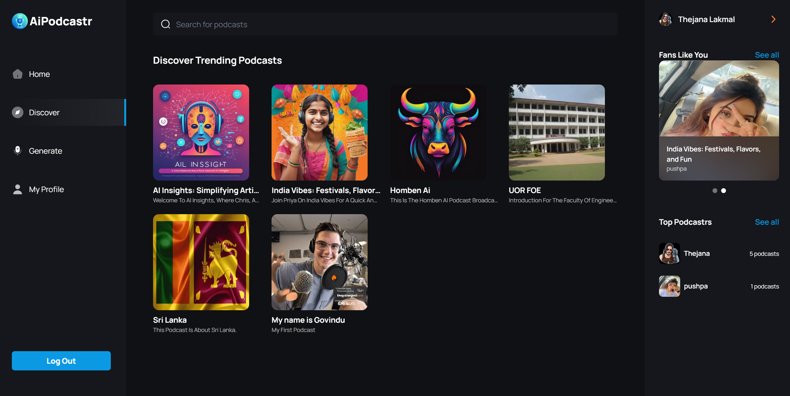
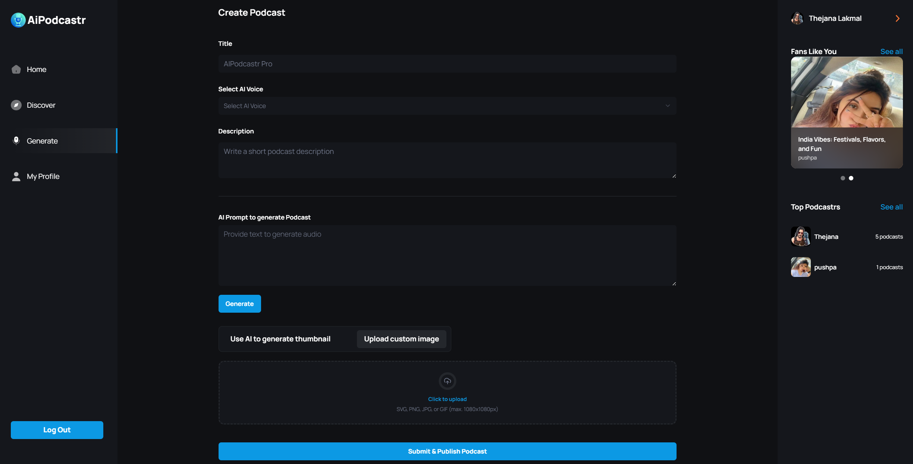
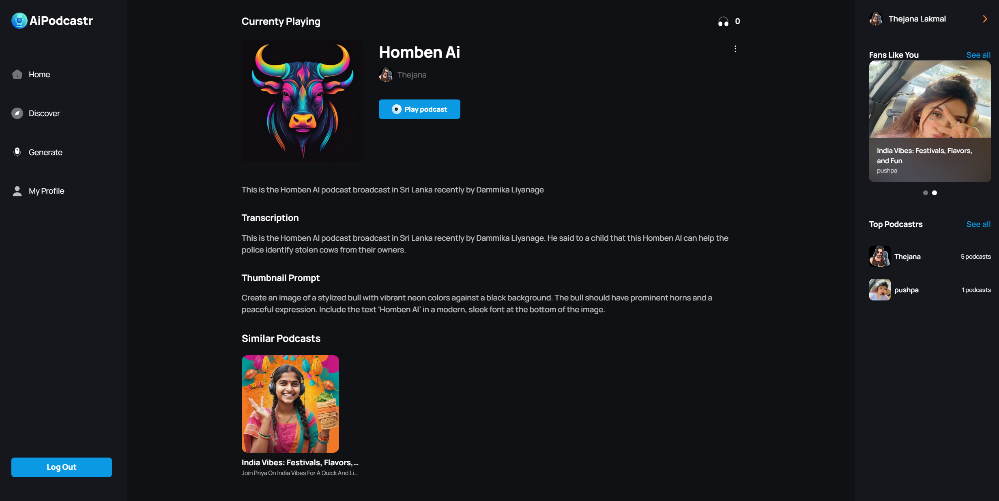
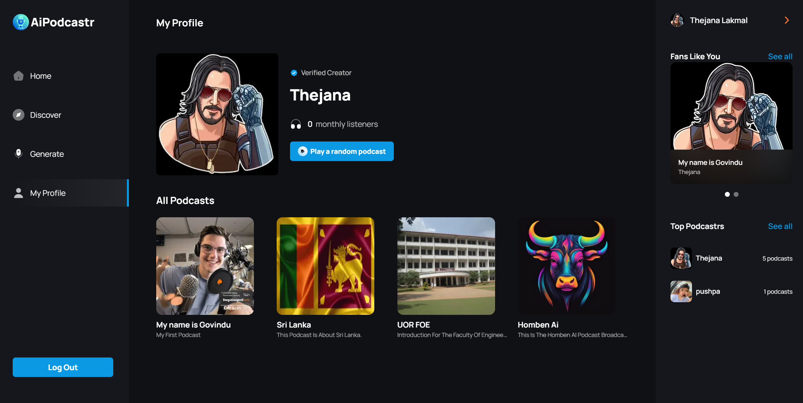

<div align="center">
  <br />
      
  <br />

  <div>
    
    
    
    
    
    
    
    

  </div>

  <h1 align="center">AI Podcast Platform</h1>

  
  [](https://github.com/deepsingh132/aionair/actions/workflows/node.js.yml)
  [](https://github.com/facebook/react/blob/main/LICENSE)
  [](https://reactjs.org/docs/how-to-contribute.html#your-first-pull-request)
  
  [](https://www.buymeacoffee.com/deepsingh132)


</div>

## 📋 <a name="table">Table of Contents</a>

1. 🤖 [Introduction](#introduction)
2. ⚙️ [Tech Stack](#tech-stack)
3. 🔋 [Features](#features)
4. 📸 [Screenshots](#screenshots)
5. 🤸 [Getting Started](#getting-started)
6. 📄 [License](#license)
7. 📞 [Contact](#contact)


## <a name="introduction">🤖 Introduction</a>

A cutting-edge AI SaaS platform that enables users to create, discover, and enjoy podcasts with advanced features like text-to-audio conversion with multi-voice AI, podcast thumbnail Image generation and seamless playback. The platform is built using Next.js, TypeScript, Convex, OpenAI, Clerk, ShadCN, and Tailwind CSS. It offers a modern home page, podcast discovery page, search functionality, podcast creation page, profile page, podcast details page, and a responsive design for a seamless user experience.

## <a name="tech-stack">⚙️ Tech Stack</a>

- Next.js
- TypeScript
- Convex
- OpenAI
- Clerk
- ShadCN
- Tailwind CSS

## <a name="features">🔋 Features</a>

👉 **Robust Authentication**: Secure and reliable user login and registration system.

👉 **Modern Home Page**: Showcases trending podcasts with a sticky podcast player for continuous listening.

👉 **Discover Podcasts Page**: Dedicated page for users to explore new and popular podcasts.

👉 **Fully Functional Search**: Allows users to find podcasts easily using various search criteria.

👉 **Create Podcast Page**: Enables podcast creation with text-to-audio conversion, AI image generation, and previews.

👉 **Multi Voice AI Functionality**: Supports multiple AI-generated voices for dynamic podcast creation.

👉 **Profile Page**: View all created podcasts with options to delete them.

👉 **Podcast Details Page**: Displays detailed information about each podcast, including creator details, number of listeners, and transcript.

👉 **Podcast Player**: Features backward/forward controls, as well as mute/unmute functionality for a seamless listening experience.

👉 **Responsive Design**: Fully functional and visually appealing across all devices and screen sizes.

and many more, including code architecture and reusability 

## <a name="quick-start">🤸 Quick Start</a>

Follow these steps to set up the project locally on your machine.

**Prerequisites**

Make sure you have the following installed on your machine:

- [Git](https://git-scm.com/)
- [Node.js](https://nodejs.org/en)
- [npm](https://www.npmjs.com/) (Node Package Manager)

**Cloning the Repository**

```bash
git clone https://github.com/Govindu-Thejana/aipodcaster.git
```

**Installation**

Install the project dependencies using npm:

```bash
npm install
```

**Set Up Environment Variables**

Create a new file named `.env` in the root of your project and add the following content:

```env
CONVEX_DEPLOYMENT=
NEXT_PUBLIC_CONVEX_URL=
NEXT_PUBLIC_CLERK_PUBLISHABLE_KEY=
CLERK_SECRET_KEY=
NEXT_PUBLIC_CLERK_SIGN_IN_URL='/sign-in'
NEXT_PUBLIC_CLERK_SIGN_UP_URL='/sign-up'
```

Replace the placeholder values with your actual Convex & Clerk credentials. You can obtain these credentials by signing up on the [Convex](https://www.convex.dev/) and [Clerk](https://clerk.com/) websites.

**Running the Project**

```bash
npm run dev
```

Open [http://localhost:3000](http://localhost:3000) in your browser to view the project.

## <a name="snippets">🕸️ Snippets</a>

<details>
<summary><code>app/globals.css</code></summary>

```css
@tailwind base;
@tailwind components;
@tailwind utilities;

* {
  margin: 0;
  padding: 0;
  box-sizing: border-box;
}

:root {
  --primary-color: #00040e;
  --accent-color: #0c99e4;
}

html {
  background-color: var(--primary-color);
}

@layer utilities {
  .input-class {
    @apply text-16 placeholder:text-16 bg-black-1 rounded-[6px] placeholder:text-gray-1 border-none text-gray-1;
  }
  .podcast_grid {
    @apply grid grid-cols-2 gap-7 sm:grid-cols-2 lg:grid-cols-3 2xl:grid-cols-4 overflow-visible;
  }
  .podcast_item {
  @apply transition-all transform duration-300 ease-in-out;
  }
  .podcast_item:hover {
    @apply scale-105 shadow-lg bg-opacity-90;
  }
  .right_sidebar {
    @apply sticky right-0 top-0 flex w-[310px] flex-col overflow-y-hidden border-none bg-black-1 px-[30px] pt-8 max-xl:hidden;
  }
  .left_sidebar {
    @apply sticky left-0 top-0 flex w-fit flex-col  justify-between  border-none  bg-black-1 pt-8 text-white-1 max-md:hidden lg:w-[270px] lg:pl-8;
  }
  .generate_thumbnail {
    @apply mt-[30px] flex w-full max-w-[520px] flex-col justify-between gap-2 rounded-lg border border-black-6 bg-black-1 px-2.5 py-2 md:flex-row md:gap-0;
  }
  .image_div {
    @apply flex-center mt-5 h-[142px] w-full cursor-pointer flex-col gap-3 rounded-xl border-[3.2px] border-dashed border-black-6 bg-black-1;
  }
  .carousel_box {
    @apply relative flex h-fit aspect-square w-full flex-none cursor-pointer flex-col justify-end rounded-xl border-none;
  }
  .button_bold-16 {
    @apply text-[16px] font-bold text-white-1 transition-all duration-500;
  }
  .flex-center {
    @apply flex items-center justify-center;
  }
  .text-12 {
    @apply text-[12px] leading-normal;
  }
  .text-14 {
    @apply text-[14px] leading-normal;
  }
  .text-16 {
    @apply text-[16px] leading-normal;
  }
  .text-18 {
    @apply text-[18px] leading-normal;
  }
  .text-20 {
    @apply text-[20px] leading-normal;
  }
  .text-24 {
    @apply text-[24px] leading-normal;
  }
  .text-32 {
    @apply text-[32px] leading-normal;
  }
}

/* ===== custom classes ===== */

.custom-scrollbar::-webkit-scrollbar {
  width: 3px;
  height: 3px;
  border-radius: 2px;
}

.custom-scrollbar::-webkit-scrollbar-track {
  background: #15171c;
}

.custom-scrollbar::-webkit-scrollbar-thumb {
  background: #222429;
  border-radius: 50px;
}

.custom-scrollbar::-webkit-scrollbar-thumb:hover {
  background: #555;
}
/* Hide scrollbar for Chrome, Safari and Opera */
.no-scrollbar::-webkit-scrollbar {
  display: none;
}

/* Hide scrollbar for IE, Edge and Firefox */
.no-scrollbar {
  -ms-overflow-style: none; /* IE and Edge */
  scrollbar-width: none; /* Firefox */
}
.glassmorphism {
  background: rgba(255, 255, 255, 0.25);
  backdrop-filter: blur(4px);
  -webkit-backdrop-filter: blur(4px);
}
.glassmorphism-auth {
  background: rgba(6, 3, 3, 0.711);
  backdrop-filter: blur(4px);
  -webkit-backdrop-filter: blur(4px);
}
.glassmorphism-black {
  background: rgba(18, 18, 18, 0.64);
  backdrop-filter: blur(37px);
  -webkit-backdrop-filter: blur(37px);
}

/* ======= clerk overrides ======== */
.cl-socialButtonsIconButton {
  border: 2px solid #222429;
}
.cl-button {
  color: white;
}
.cl-socialButtonsProviderIcon__github {
  filter: invert(1);
}
.cl-internal-b3fm6y {
  background: #00BCD4;
}
.cl-formButtonPrimary {
  background: #00BCD4;
}
.cl-footerActionLink {
  color: #00BCD4;
}
.cl-headerSubtitle {
  color: #c5d0e6;
}
.cl-logoImage {
  width: 10rem;
  height: 3rem;
}
.cl-internal-4a7e9l {
  color: white;
}

.cl-userButtonPopoverActionButtonIcon {
  color: white;
}
.cl-internal-wkkub3 {
  color: #00BCD4;
}
```
## <a name="screenshots">📸 Screenshots</a>

| Homepage |
| :-----------: |
|    |
| Discover Page |
|    |
| Create Podcast Page |
|  |
| Podcast Details Page |
|   |
| Profile Page |
|   |


